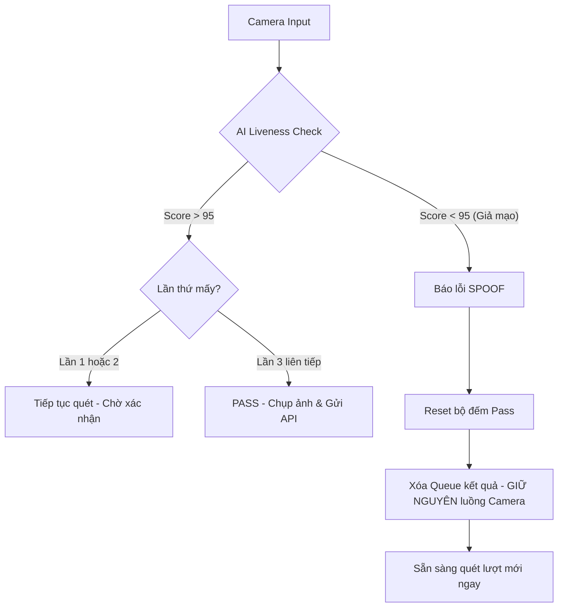

# Phân tích Kỹ thuật & Giải pháp Liveness (Anti-Spoofing)

Tài liệu này trình bày phân tích chuyên sâu về hai lỗi nghiêm trọng hệ thống gặp phải và phương pháp xử lý tối ưu nhất dựa trên cấu trúc của FacePass SDK và phần cứng RK3568.

---

## 1. Lỗi Lọt Ảnh Giả ở Lần đầu (Liveness Bypass)

### Triệu chứng:
Khi dùng điện thoại đưa ảnh giả vào, lần quét đầu tiên (`Liveness Score`) thường vượt qua ngưỡng an toàn (thậm chí là 95.0), nhưng các lần quét tiếp theo ngay sau đó thì bị chặn lại.

### Nguyên nhân (Phân tích chuyên gia):
- **Thiếu dữ liệu thời gian (Temporal Baseline):** Các thuật toán Liveness hiện đại không chỉ soi pixel mà còn soi sự biến đổi của bề mặt da theo thời gian để phân biệt vật thể 3D (mặt thật) và mặt phẳng 2D (màn hình). 
- **Lỗi khung hình đầu:** Tại khung hình đầu tiên của một `TrackId` mới, SDK chưa có dữ liệu lịch sử để so sánh sự biến đổi. Do đó, nếu màn hình điện thoại có độ phân giải cao và độ sáng tốt, AI có thể bị đánh lừa trong tích tắc và đưa ra kết quả "Lạc quan" (False Positive).

### Giải pháp khắc phục:
- **Cơ chế: Xác nhận ba lần (Triple Confirmation)**. Chúng ta yêu cầu SDK phải chứng minh được đối tượng đó là thật trong **3 khung hình liên tiếp**.
- **Hiệu quả:** Đến khung hình thứ 2 hoặc thứ 3, dữ liệu thời gian của SDK đã đầy đủ. Lúc này, AI sẽ nhận ra sự thiếu hụt về chiều sâu và sự phản xạ ánh sáng không tự nhiên của màn hình điện thoại, từ đó trả về `Fail` chính xác.

**Vị trí Code:** `FacePassActivity.java`
- **Dòng 137-140:** Khai báo biến đếm `mConsecutivePassCount`.
- **Dòng 403-415:** Kiểm tra điều kiện `mConsecutivePassCount < REQUIRED_PASS_COUNT` trước khi cho phép chụp ảnh.

---

## 2. Lỗi Treo Camera (Freeze/Hang)

### Triệu chứng:
Sau khi máy báo "SPOOF DETECTED" (Phát hiện giả mạo), màn hình camera đứng hình, không thể quét tiếp trừ khi tắt hẳn App và bật lại.

### Nguyên nhân (Phân tích chuyên gia):
- **Cạn kiệt bộ đệm (Buffer Starvation):** Camera hoạt động dựa trên cơ chế xoay vòng bộ đệm (Buffer Pooling). Khi ta nạp một bộ đệm vào Camera, nó sẽ giữ để đổ dữ liệu vào, trả ra cho App xử lý, sau đó App phải trả lại bộ đệm đó cho Camera.
- **Lỗi xử lý hàng đợi:** Trong code cũ, khi gặp ảnh giả, chúng ta gọi lệnh `ComplexFrameHelper.clear()`. Lệnh này xóa sạch và `null` hóa các bộ đệm đang chờ xử lý. 
- **Hậu quả:** Camera driver đang đợi App trả lại bộ đệm cũ để dùng tiếp, nhưng App lại xóa sạch "dấu vết" của bộ đệm đó. Kết quả là Camera rơi vào trạng thái chờ đợi vô hạn (Deadlock), dẫn đến đứng hình.

### Giải pháp khắc phục:
- **Cơ chế: Xử lý hàng đợi chọn lọc (Selective Clearing)**. Chỉ xóa hàng đợi kết quả (`mDetectResultQueue`) để không xử lý các kết quả cũ, nhưng tuyệt đối **KHÔNG** xóa bộ đệm thô của camera (`ComplexFrameHelper`).
- **Hiệu quả:** Camera vẫn tiếp tục có luồng dữ liệu để chạy, máy sẽ hồi phục và quét được người tiếp theo ngay lập tức mà không bị khựng.

**Vị trí Code:** `FacePassActivity.java`
- **Dòng 536-544:** Loại bỏ lệnh xóa `ComplexFrameHelper` trong `case 4`. Chỉ giữ lại lệnh reset trạng thái và xóa hàng đợi kết quả.

---

## 3. Sơ đồ xử lý tối ưu (Mermaid)

