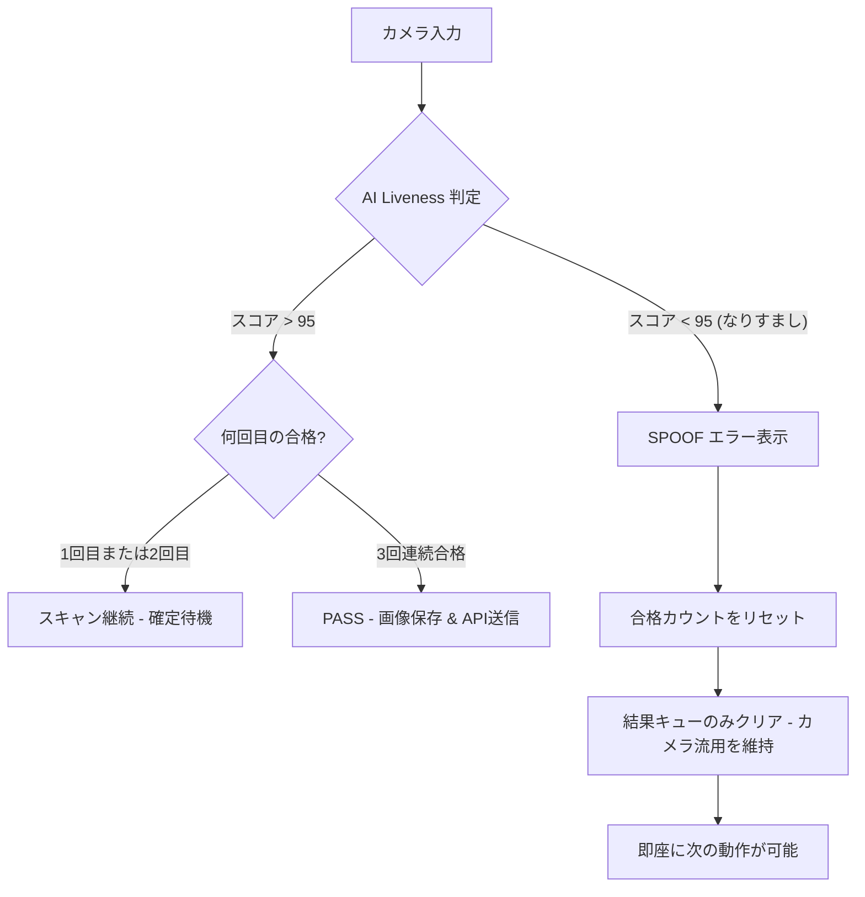

# なりすまし防止（Liveness）処理の技術分析と解決策

このドキュメントでは、システムで発生していた2つの重大な問題（バイパスおよびフリーズ）の専門的な分析と、FacePass SDKおよびRK3568ハードウェアの特性に基づいた最適な解決策について説明します。

---

## 1. 初回のなりすまし突破問題 (Liveness Bypass)

### 症状
スマートフォンなどのデバイスを使用して偽造画像を表示した場合、最初のスキャン（Liveness Score）が安全閾値（95.0など）を超えて成功判定（PASS）になってしまうことがありました。しかし、その直後の2回目以降のスキャンでは正しくブロックされます。

### 原因分析（エキスパート視点）
- **時間的基準（Temporal Baseline）の欠如:** 現代のLivenessアルゴリズムは、単一ピクセルの分析だけでなく、皮膚表面の時間的な微細な変化を分析して、3Dオブジェクト（本物の顔）と2D平面（画面）を区別します。
- **初回フレームの判定限界:** 新しい `TrackId` の最初のフレームでは、比較対象となる過去のフレームデータが存在しません。そのため、高解像度のスマートフォン画面などで静止画としての特徴が非常に精巧な場合、AIが一時的に「楽観的」な判定（False Positive）を下してしまう可能性があります。

### 解決策
- **仕組み: 三重確定（Triple Confirmation）**。SDKに対し、対象が本物であることを **3回連続のフレーム** で証明することを要求します。
- **効果:** 2フレーム目以降にはSDKの時間的分析データが蓄積されます。この時点で、AIはスマートフォンの画面特有の不自然な光の反射や奥行きの欠如を正確に検出し、正しく `Fail` を判定します。

**コードの場所:** `FacePassActivity.java`
- **137-140行目:** カウント変数 `mConsecutivePassCount` の宣言。
- **403-415行目:** 画像キャプチャ前に `mConsecutivePassCount < REQUIRED_PASS_COUNT` の条件をチェック。

---

## 2. カメラのフリーズ問題 (Freeze/Hang)

### 症状
「SPOOF DETECTED（なりすまし検出）」が表示された直後、カメラプレビューが静止し、アプリを再起動しない限りスキャンが続行できなくなります。

### 原因分析（エキスパート視点）
- **バッファの枯渇 (Buffer Starvation):** カメラは「バッファプーリング（Buffer Pooling）」という仕組みで動作しています。OSがアプリにバッファを渡し、アプリが処理した後にバッファをカメラに戻すことで循環させます。
- **キュー処理の誤り:** 以前のコードでは、なりすまし検出時に `ComplexFrameHelper.clear()` を呼び出していました。この命令は、処理待ちのバッファをすべてクリアし、参照を `null` 化してしまいます。
- **連鎖的なデッドロック:** カメラドライバーは、アプリからバッファが返ってくるのを待機し続けますが、アプリ側でそのバッファの参照を失っているため、カメラが次のフレームを取得できなくなります。これが「デッドロック」状態となり、画面が静止します。

### 解決策
- **仕組み: 選択的キュー・クリア（Selective Clearing）**。古い判定結果を処理しないように結果キュー（`mDetectResultQueue`）のみをクリアし、カメラの生データバッファ（`ComplexFrameHelper`）には一切 **手を触れない** ようにしました。
- **効果:** カメラのデータストリームが維持されるため、システムはフリーズすることなく、即座に次の人物のスキャンを再開できます。

**コードの場所:** `FacePassActivity.java`
- **536-544行目:** `case 4` 内の `ComplexFrameHelper` のクリア命令を削除。ステータスのリセットと結果キューのクリアのみに限定。

---

## 3. 最適化された処理フロー (Mermaid)

