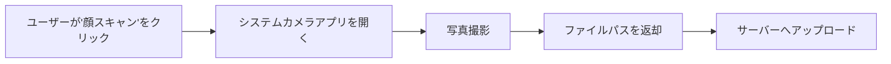
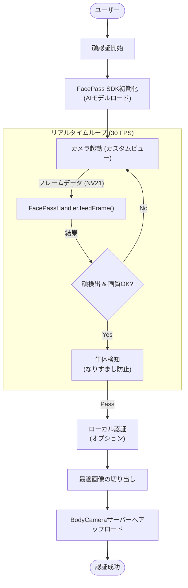
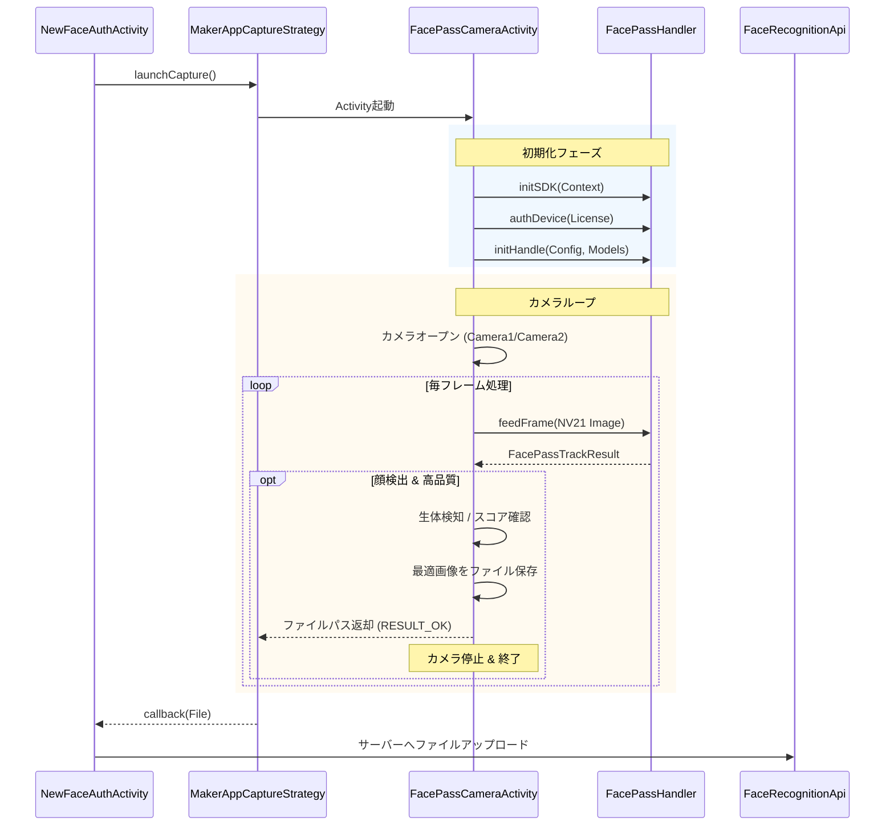

# FacePass SDK 統合設計書

## 1. 概要
本文書は、標準のAndroidカメラを使用する方式（フェーズ1）から、専用の `FacePass SDK` を統合する方式（フェーズ3）へのアーキテクチャ移行について説明します。この変更により、リアルタイムの顔追跡、生体検知（Liveness Detection）、およびより高いセキュリティが可能になります。

## 2. アーキテクチャ比較

### 現在のフロー（フェーズ1 - テスト用）
現在は `MediaStore` を使用して単純な静止画を撮影しています。

### 新しいフロー（フェーズ3 - 本番用 SDK）
`FacePass SDK` をアプリに直接埋め込みます。アプリ自体がカメラの「ドライバー」として機能します。

## 3. コンポーネント詳細連携

メーカー提供のデモにあるロジックを実装した新しいActivity `FacePassCameraActivity` を作成します。

## 4. 実装ステップ (方針)

これを実現するために、以下の手順を実行します：

1.  **依存関係の追加**:
    *   `facepass.aar` を `libs/` に追加 (完了)
    *   `.bin` モデルとライセンスを `assets/` に追加 (完了)

2.  **ヘルパークラス (デモからの移植)**:
    *   `CameraManager.java` をコピー: ローレベルなカメラハードウェア制御。
    *   `ComplexFrameHelper.java` をコピー: フレームバッファの管理。
    *   `FaceConfig.java` / `SettingVar.java` をコピー: SDKパラメータ管理。

3.  **新しい画面 (`FacePassCameraActivity`)**:
    *   デモの `MainActivity` を「必要最小限」にしたバージョンを作成します。
    *   SDKを自動的に初期化します。
    *   画質が良い顔画像を検出したら、即座に自動キャプチャします（「登録」ボタンなどは不要）。

4.  **ストラテジーの接続**:
    *   外部アプリを待機するのではなく、この新しい `FacePassCameraActivity` を起動するように `MakerAppCaptureStrategy.kt` を更新します。
