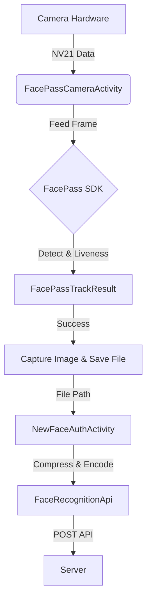

# FacePass Mechanism Explanation (Cơ chế hoạt động)

Tài liệu này giải thích chi tiết cách hệ thống hoạt động "dưới nắp ca-pô" (under the hood), từ lúc Camera mở lên cho đến khi gửi ảnh về Server.

## 1. Tổng quan Luồng dữ liệu (Data Flow)




## 2. Chi tiết từng bước

### Bước 1: Khởi tạo & Camera (FacePassCameraActivity)
*   **Init:** Khi Activity mở lên, `FacePassHandler` được khởi tạo và load các module AI (Detect, Liveness, PoseBlur...) từ thư mục `assets`.
*   **Preview:** `CameraManager` mở camera và liên tục đẩy dữ liệu hình ảnh (dạng byte array `NV21`) vào hàng đợi thông qua `ComplexFrameHelper`.

### Bước 2: Xử lý AI của SDK (Face Detection & Liveness)
Đây là phần cốt lõi của FacePass.
*   **FeedFrameThread:** Luồng này chạy ngầm, liên tục lấy hình từ Camera và "đút" (feed) vào SDK:
    ```java
    mFacePassHandler.feedFrame(imageRGB); 
    // hoặc feedFrameRGBIR nếu dùng Camera kép
    ```
*   **Bên trong SDK:** Nó sẽ tự động làm các việc sau:
    1.  **Detection:** Tìm khuôn mặt trong khung hình.
    2.  **Tracking:** Theo dõi khuôn mặt đó qua các khung hình liên tiếp.
    3.  **Quality Check:** Kiểm tra chất lượng (độ mờ, độ sáng, góc nghiêng).
    4.  **Liveness Check (Chống giả mạo):**
        *   Dựa trên model `liveness.CPU.rgb.G.bin`.
        *   Nếu dùng Camera kép (RGB + IR), nó sẽ so sánh sự chênh lệch giữa ảnh màu và ảnh hồng ngoại (dựa trên tham số `setIRConfig` đã nói trước đó) để biết đó là da người thật hay là mặt nạ/màn hình điện thoại.

### Bước 3: Xử lý Kết quả (Result Handling)
*   SDK trả về kết quả `FacePassTrackResult`.
*   **RecognizerThread:** Luồng này kiểm tra kết quả:
    ```java
    if (result.trackedFaces.length > 0) { ... }
    ```
    *   **QUAN TRỌNG:** Code đã được cập nhật để kiểm tra chặt chẽ **Liveness Score** (Chống giả mạo).
    *   Sử dụng hàm `mFacePassHandler.livenessClassify(...)`.
    *   Nếu kết quả trả về `LIVENESS_PASS` (0) thì mới chấp nhận chụp. Nếu là ảnh giả (`LIVENESS_UNPASS`) hoặc nghi ngờ (`RETRY`), nó sẽ **từ chối** và bỏ qua khung hình đó.

### Bước 4: Chụp ảnh & Trả về (Capture & Return)
*   Khi xác nhận khuôn mặt hợp lệ, App sẽ lấy dữ liệu khung hình đó (`nv21Data`), chuyển đổi thành file ảnh **JPG** và lưu vào bộ nhớ.
*   Activity đóng lại (`finish()`) và trả về đường dẫn file ảnh (`EXTRA_IMAGE_PATH`) cho màn hình gọi nó.

### Bước 5: Gửi lên Server (NewFaceAuthActivity)
*   `NewFaceAuthActivity` nhận được đường dẫn file ảnh.
*   **Xử lý ảnh:**
    *   Nén ảnh (Compress) để giảm dung lượng (thường server yêu cầu < 1MB).
    *   Xoay ảnh cho đúng chiều (nhờ đọc EXIF orientation).
*   **Gọi API:** Dùng `FaceRecognitionApi` để gửi ảnh lên Server:
    *   Endpoint: `/api/face/recognize` (hoặc tương tự).
    *   Data: File ảnh + DeviceID.

### Bước 6: Server Phản hồi
*   Server so sánh ảnh nhận được với cơ sở dữ liệu khuôn mặt.
*   Trả về JSON: `{ "status": 1, "name": "Nguyen Van A", ... }`.
*   App hiển thị màn hình kết quả (`VeinResultActivity`).
