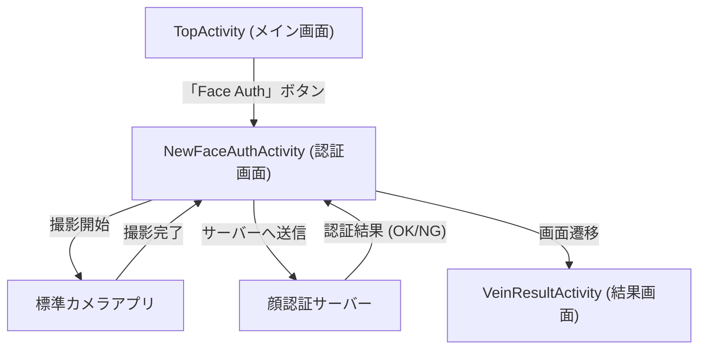

# Tài liệu mô tả luồng xử lý (Flow Documentation) / 処理フロー詳細資料

## Tiếng Việt (Vietnamese)

Dưới đây là mô tả chi tiết luồng xử lý của các file đã thêm, bắt đầu từ màn hình chính (TopActivity) cho đến khi kết thúc quá trình xác thực.

### 1. Màn hình chính (`TopActivity.kt`)
Điểm bắt đầu để kích hoạt luồng xác thực mới.

*   **`onCreate()`**:
    *   Khởi tạo giao diện và các thành phần cơ bản.
    *   Gọi `setClickListeners()` để lắng nghe sự kiện nút bấm.
*   **`setClickListeners()`**:
    *   **Nút Settings**: Mở `SettingsActivity` để người dùng nhập cấu hình (URL, Device ID).
    *   **Nút "Face Auth" (Luồng mới)**:
        1.  Lưu trạng thái xác thực là "Face".
        2.  Gọi `startActivity` để khởi chạy **`NewFaceAuthActivity`**.
        3.  Đây là bước chuyển giao quyền điều khiển sang module xác thực mới.

### 2. Màn hình cài đặt (`SettingsActivity.kt`)
Nơi người dùng nhập thông tin cấu hình cho luồng mới.

*   **`loadSettings()`**: Hiển thị URL và Device ID đã lưu.
*   **`saveSettings()`**: Kiểm tra và lưu URL, Device ID vào `SharedPreferences` để `NewFaceAuthActivity` sử dụng sau này.

### 3. Quy trình xác thực khuôn mặt mới (`NewFaceAuthActivity.kt`)
Activity trung tâm xử lý toàn bộ luồng Face Auth mới.

*   **`onCreate()`**:
    *   Kiểm tra quyền Camera xem người dùng đã cho phép chưa.
    *   Nếu đã cho phép, tự động kích hoạt quy trình chụp ảnh ngay lập tức (`startCaptureSafe`).
*   **`startCaptureSafe()`**:
    *   Ra lệnh cho module chụp ảnh (`captureStrategy`) bắt đầu làm việc.
*   **`CameraCaptureStrategy.kt` (launchCapture)**:
    *   Mở ứng dụng Camera có sẵn trên máy để người dùng chụp 1 bức ảnh.
*   **`onActivityResult()` (Quay lại NewFaceAuthActivity)**:
    *   Nhận tín hiệu "đã chụp xong".
    *   Lấy file ảnh vừa chụp được và chuyển sang bước xử lý tiếp theo (`processFaceImage`).

#### Chi tiết xử lý Logic và Gọi API (`processFaceImage`)
Đây là phần quan trọng nhất, nơi 'bộ não' của ứng dụng làm việc. Dưới đây là giải thích từng bước những gì code đang thực hiện:

1.  **Chuẩn bị ảnh (`compressImageIfNeeded`)**:
    *   Code: `val compressedFile = compressImageIfNeeded(file)`
    *   **Ý nghĩa**: Ảnh chụp gốc thường rất nặng (3-5MB). Dòng này sẽ thu nhỏ ảnh xuống (khoảng 1024px) và xoay cho đúng chiều (ví dụ chụp dọc thì xoay dọc). Mục đích để gửi đi nhanh hơn và server dễ xử lý.
2.  **Lấy thông tin cài đặt (`SharedPreferences`)**:
    *   Code: `val serverUrl = prefs.getString(...)`
    *   **Ý nghĩa**: Ứng dụng mở "bộ nhớ cài đặt" ra để xem người dùng đã nhập Server URL là gì và Device ID là gì. Nếu chưa nhập thì sẽ dừng lại và báo lỗi.
3.  **Gửi dữ liệu đi (`FaceRecognitionApi.sendFaceRecognition`)**:
    *   Code: `val responseJson = FaceRecognitionApi.sendFaceRecognition(...)`
    *   **Ý nghĩa**: Đây là lệnh "Gửi thư". Ứng dụng đóng gói Ảnh + Device ID vào một gói tin và gửi đến địa chỉ Server URL đã lấy ở bước trên. Sau đó ứng dụng ngồi đợi Server trả lời.
4.  **Nhận câu trả lời (`handleAuthResult`)**:
    *   Code: `val result = gson.fromJson(...)`
    *   **Ý nghĩa**: Server trả về một chuỗi văn bản (JSON). Dòng này dịch chuỗi đó thành các thông tin cụ thể: Tên người, Mã số, Độ giống bao nhiêu %.
5.  **Chuyển màn hình (`VeinResultActivity`)**:
    *   Code: `startActivity(intent)`
    *   **Ý nghĩa**: Sau khi đã có kết quả, ứng dụng mở màn hình Kết Quả lên và hiển thị thông tin cho người dùng xem.

### 4. Chi tiết kỹ thuật gửi tin (`FaceRecognitionApi.java`)
Đây là lớp "người đưa thư", chịu trách nhiệm kết nối mạng.

*   **`sendFaceRecognition(...)`**:
    *   **Kết nối**: `URL url = new URL(serverUrl)` -> Tìm đường đến địa chỉ máy chủ.
    *   **Đóng gói dữ liệu (Multipart)**:
        *   `addFormField(..., "timestamp", ...)`: Ghi ngày giờ gửi.
        *   `addFormField(..., "deviceId", ...)`: Ghi mã số thiết bị.
        *   `outputStream.write(imageBytes)`: Bỏ bức ảnh vào phong bì.
    *   **Gửi đi**: `outputStream.flush()` -> Đẩy toàn bộ dữ liệu lên mạng.
    *   **Nghe trả lời**: `readStream(connection.getInputStream())` -> Đọc những gì Server nói lại (thường là kết quả xác thực).

---
---

## 日本語 (Japanese)

以下は、今回追加・修正したファイル群の処理フローの詳細説明です。TopActivityから認証完了までの流れを記述します。

### 1. メイン画面 (`TopActivity.kt`)
認証フロー（新フロー）の起点です。

*   **`onCreate()`**:
    *   UI初期化を行います。
    *   `setClickListeners()` を呼び出し、ボタン操作を監視します。
*   **`setClickListeners()`**:
    *   **Settingsボタン**: `SettingsActivity` を起動し、設定画面を表示します。
    *   **Face Authボタン (新フロー)**:
        1.  認証モードを "Face" として保存します。
        2.  `startActivity` で **`NewFaceAuthActivity`** を起動します。
        3.  ここから新しい認証モジュールに処理が移譲されます。

### 2. 設定画面 (`SettingsActivity.kt`)
新フローで使用する接続先やIDを設定する画面です。

*   **`loadSettings()`**: 保存済みのURLとDevice IDを表示します。
*   **`saveSettings()`**: 入力値を検証し、`SharedPreferences` に保存します。この値が後続の処理で使用されます。

### 3. 新顔認証フロー (`NewFaceAuthActivity.kt`)
新しい顔認証ロジックを一括管理する中心的なActivityです。

*   **`onCreate()`**:
    *   カメラ権限を確認 (`checkPermission`) します。
    *   権限がある場合、即座に `startCaptureSafe()` を呼び出します。
*   **`startCaptureSafe()`**:
    *   `captureStrategy.launchCapture(this)` を実行します。現在の `captureStrategy` は `CameraCaptureStrategy` のインスタンスです。
*   **`CameraCaptureStrategy.kt` (launchCapture)**:
    *   `MediaStore` を使用して画像保存用のURIを作成します。
    *   `MediaStore.ACTION_IMAGE_CAPTURE` Intentを使って標準カメラを起動します。
*   **`onActivityResult()` (NewFaceAuthActivityに戻る)**:
    *   撮影結果を受け取ります。
    *   `captureStrategy.onActivityResult` を呼び出し、URIをFileオブジェクトに変換します。
    *   成功時、そのFileを引数に `processFaceImage(file)` を呼び出します。
*   **`processFaceImage(file)`**:
    1.  **画像処理**: `compressImageIfNeeded(file)` を呼び出し、画像を1024pxにリサイズ・正立回転させます。
    2.  **設定取得**: `SharedPreferences` から `serverUrl` と `deviceId` を取得します。未設定の場合はエラーを表示して処理を中断します。
    3.  **API送信**: 画像ファイル、deviceId、URLを引数に `FaceRecognitionApi.sendFaceRecognition(...)` を呼び出します。
*   **`FaceRecognitionApi.java`**:
    *   `MultipartBody` を構築し、画像データとメタデータをセットします。
    *   `OkHttp` クライアントを使用して、指定された `serverUrl` へPOSTリクエストを送信します。
    *   サーバーからのレスポンス（JSON文字列）を返します。
*   **`handleAuthResult(result)` (NewFaceAuthActivityに戻る)**:
    *   JSONレスポンスを `FaceAuthResponse` オブジェクトに変換します。
    *   結果表示画面である `VeinResultActivity` へのIntentを作成します。
    *   認証結果（名前、ID、類似度など）をIntentに格納し、`startActivity` で遷移します。

---

## Biểu đồ luồng (Merged - Unified Logic)

