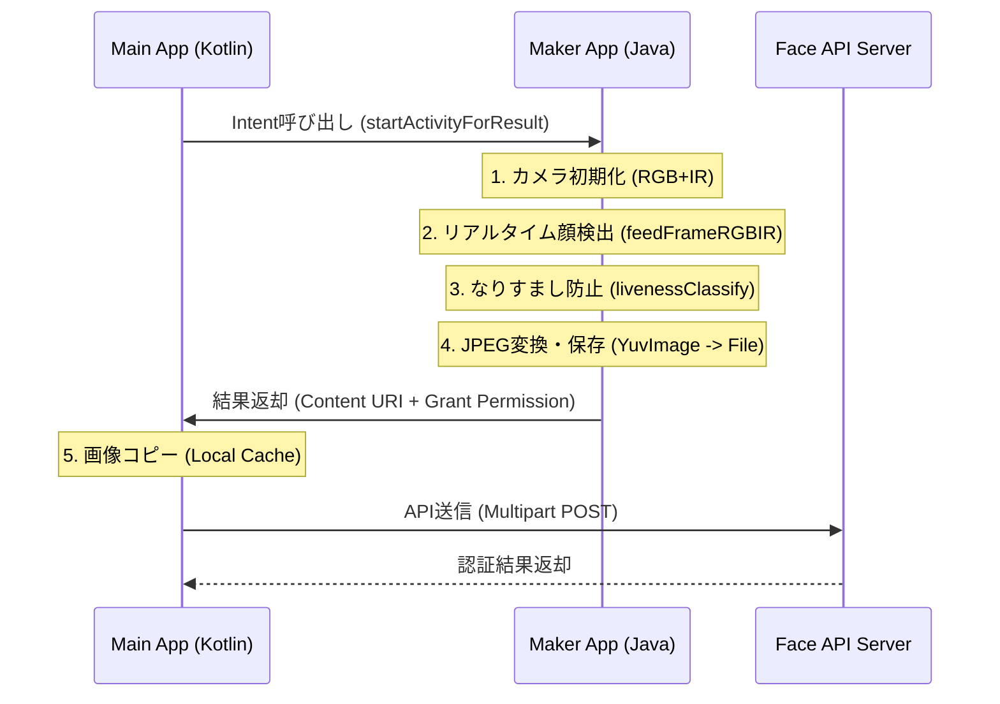

# 顔認証システム技術レポート (Main App & Maker App 連携)

本レポートでは、メインアプリケーション（Main App）とMaker SDKベースのキャプチャアプリケーション（Maker App）間の連携フロー、生体検知（なりすまし防止）、および画像データの受け渡しメカニズムについて記述します。

---

## 1. 全体フロー概略図

---

## 2. 詳細処理プロセス

### A. Maker Appへの遷移 (Main App側)
メインアプリの `MakerAppCaptureStrategy.kt` がキャプチャを開始します。
- **使用関数:** `launchCapture(activity: AppCompatActivity)`
- **仕組み:** Android標準の `Intent` メカニズムを使用し、パッケージ名 (`mcv.testfacepass`) とクラス名 (`FacePassActivity`) を明示的に指定して起動します。

### B. 顔検出とデータ処理 (Maker App側)
Maker Appはバックグラウンドで2つのスレッドを回してリアルタイム処理を行います。
1. **FeedFrameThread:** 
   - `ComplexFrameHelper` からRGBとIRのカメラ同期フレームを取得します。
   - **使用関数:** `mFacePassHandler.feedFrameRGBIR(imageRGB, imageIR)` を呼び出し、SDKにデータを送信します。
2. **RecognizeThread:** 
   - 抽出された顔データをキューから取り出し、なりすまし判定を行います。

### C. なりすまし防止メカニズム (Anti-spoofing)
撮影者が「生きている人間」であるかを判定する最も重要なステップです。
- **使用関数:** `mFacePassHandler.livenessClassify(...)`
- **判定条件:** `FacePassLivenessResult.livenessState == 0` (LIVENESS_PASS) の場合のみ、画像の保存と返却処理へ進みます。
- **防止対象:** スマートフォン画面の再撮影、写真プリント、3Dマスク、ビデオ再生などをRGBとIR（赤外線）の視差 và 反射率の違いでブロックします。

### D. 画像保存とセキュリティ (Maker App側)
なりすまし判定をパスすると、画像を保存してメインアプリに権限を委譲します。
1. **変換:** NV21形式を `YuvImage` を使用してJPEGに圧縮（品質80%、回転270度）。
2. **保存:** `getExternalCacheDir()` 内に保存。
3. **返却:** `FileProvider` を使用して、安全な `content://` URIを生成します。
   - **使用関数:** `FileProvider.getUriForFile(...)`
   - **権限付与:** `Intent.FLAG_GRANT_READ_URI_PERMISSION` をセットし、メインアプリが保護されたファイルに1回限りアクセスできるようにします。

### E. 画像の受け取りとAPI送信 (Main App側)
1. **受け取り:** `MakerAppCaptureStrategy.kt` の `onActivityResult` で `data.getData()` からURIを取得。
2. **コピー:** セキュリティと安定性の断絶を防ぐため、URIの内容を自アプリのキャッシュ領域に物理コピーします (`inputStream.copyTo(outputStream)`)。
3. **送信:** `NewFaceAuthActivity.kt` で画像をリサイズし、`faceService.recognize` 経由でAPI送信。
4. **フロー分岐 (Flow 3対応):** 
   - **Flow 1 (単体):** 認証成功後、直接結果画面 (`VeinResultActivity`) へ遷移します。
   - **Flow 3 (顔+静脈):** 認証成功後、結果を `TopActivity` へ返却。`TopActivity` が「顔認証完了」メッセージを表示し、自動的に静脈認証アプリ (PalmSecure) を起動します。

---

## 3. 使用されている主な主要コード

| コンポーネント | クラス/ファイル | 主要なメソッド/機能 |
| :--- | :--- | :--- |
| **Main App** | `MakerAppCaptureStrategy.kt` | `launchCapture`, `onActivityResult` (URI処理) |
| **Main App** | `NewFaceAuthActivity.kt` | `processFaceImage` (API連携の起点) |
| **Maker App** | `FacePassActivity.java` | `RecognizeThread.run`, `livenessClassify` |
| **Maker App** | `FacePassManager.java` | `initSDK`, `mFacePassHandler` (SDK心臓部) |
| **Maker App** | `ComplexFrameHelper.java` | `takeComplexFrame`, `clear` (カメラ同期) |
| **Shared** | `AndroidManifest.xml` (Maker) | `<provider>` (FileProvider定義) |

---

## 4. 今回の主な修正ポイント (サマリー)
1. **パーミッションエラー:** スコープストレージ制限を `FileProvider` 経由のURI渡しで解決しました。
2. **画像回転:** RK3568デバイスのカメラ配置に合わせ、角度を `270度` に固定しました。
3. **1回限りの成功:** 静的バッファのリセット処理 (`ComplexFrameHelper.clear()`) を各ライフサイクルに追加しました。
4. **APIタイムアウト:** JPEG品質を100%から80%に落とし、転送速度を高速化しました。

Đúng như bạn nhận định, luồng xử lý được thiết kế rất chặt chẽ theo trình tự: Phát hiện khuôn mặt -> Kiểm tra tính hợp lệ (Chống giả mạo) -> Lưu ảnh & Trả kết quả.

Dưới đây là các dòng code cụ thể trong file 
FacePassActivity.java
 xử lý luồng này:

1. Luồng kiểm tra Liveness (Dòng 357 - 365)
Tại đây, hệ thống lấy dữ liệu khuôn mặt từ hàng đợi và gọi hàm của SDK để kiểm tra xem đó là người thật hay ảnh chụp/video.

java
// Dòng 357-358: Gọi hàm kiểm tra chống giả mạo
Log.d(DEBUG_TAG, "RecognizeThread: Calling livenessClassify...");
FacePassLivenessResult[] livenessResult = FacePassManager.mFacePassHandler.livenessClassify(...);
// Dòng 365: Kiểm tra trạng thái trả về
switch (result.livenessState) {
2. Chỉ chụp ảnh khi Liveness vượt qua (Dòng 366 - 368)
Chỉ khi SDK trả về giá trị 0 (tương ứng với LIVENESS_PASS), hệ thống mới bắt đầu quá trình "ULTIMATE CAPTURE" (Chụp ảnh và lưu file).

java
case 0: // Trạng thái vượt qua kiểm tra người thật
    slivenessStat = "LIVENESS_PASS";
    Log.d(DEBUG_TAG, "LIVENESS_PASS - ULTIMATE CAPTURE START");
3. Xử lý ảnh và Lưu file (Dòng 379 - 425)
Sau khi xác nhận là người thật, code sẽ chuyển đổi định dạng Camera (NV21) sang ảnh (JPEG), xoay 270 độ và lưu vào cache của ứng dụng.

Dòng 387: Nén sang JPEG.
Dòng 398: Xoay 270 độ để ảnh đúng chiều đứng.
Dòng 417: Lưu file vật lý xuống bộ nhớ.
4. Gửi ảnh về App chính (Dòng 453 - 471)
Đây là bước cuối cùng, đóng giao diện Maker App và gửi "Giấy thông hành" dữ liệu về cho ứng dụng của bạn.

java
// Dòng 458-463: Cấp quyền truy cập URI an toàn (FileProvider)
android.net.Uri contentUri = android.support.v4.content.FileProvider.getUriForFile(...);
resultIntent.setData(contentUri);
resultIntent.addFlags(Intent.FLAG_GRANT_READ_URI_PERMISSION);
// Dòng 469-470: Trả kết quả OK và kết thúc App Maker
setResult(Activity.RESULT_OK, resultIntent);
finish();
Tóm lại: Nếu không vượt qua bước chống giả mạo (case 0), code sẽ rơi vào các trường hợp RETRY hoặc UNPASS (Dòng 476 - 495) và sẽ không bao giờ chạy đến đoạn mã chụp ảnh hay setResult. Điều này đảm bảo tính an toàn tuyệt đối cho hệ thống của bạn.
log
FacePassDemo            mcv.testfacepass                     I  rect[0] = (229.0, 125.0, 676.0, 510.0
2026-01-22 08:59:03.062  9798-25783 ]time                   mcv.testfacepass                     I  feedfream 110 ms
2026-01-22 08:59:03.090   191-581   BufferQueueProducer     surfaceflinger                       E  [mcv.testfacepass/mcv.testfacepass.FacePassActivity#0](id:bf00001140,api:0,p:-1,c:191) disconnect: not connected (req=1)
2026-01-22 08:59:03.090  9798-9821  libEGL                  mcv.testfacepass                     W  EGLNativeWindowType 0x75471f9a50 disconnect failed
1. Dòng Log về nhận diện (Dấu hiệu thành công)
Log: rect[0] = (229.0, 125.0, 676.0, 510.0)
Giải thích: SDK FacePass đã tìm thấy 01 khuôn mặt trong khung hình. Các con số trong ngoặc là tọa độ (trái, trên, phải, dưới) của khung hình chữ nhật bao quanh khuôn mặt đó. Điều này chứng tỏ Camera và thuật toán nhận diện đang hoạt động rất tốt.
Log: ]time ... feedfream 110 ms
Giải thích: Đây là thời gian xử lý của thuật toán cho 1 khung hình. Con số 110 ms (0.11 giây) cho thấy tốc độ xử lý rất nhanh, đảm bảo trải nghiệm mượt mà. (Lưu ý: "feedfream" là một lỗi chính tả trong code gốc của SDK, ý là "feed frame").
2. Dòng Log về lỗi hệ thống (Cảnh báo khi đóng App)
Log: BufferQueueProducer ... disconnect: not connected (req=1)
Log: libEGL ... EGLNativeWindowType ... disconnect failed
Giải thích: Đây là các lỗi/cảnh báo từ Hệ điều hành Android (SurfaceFlinger và OpenGL), không phải từ logic code của chúng ta.
Tại sao nó xuất hiện? Khi bạn hoàn thành quét mặt, App Maker gọi lệnh finish() để đóng màn hình và quay về App chính. Quá trình này diễn ra cực nhanh (ngay khi vừa nhận diện xong). Hệ thống đồ họa của máy (EGL) đang cố gắng giải phóng bộ nhớ của camera preview nhưng vì cửa sổ ứng dụng đã đóng trước đó vài mili giây nên nó không tìm thấy "kết nối" để ngắt.
Mức độ nguy hiểm: Vô hại (Harmless). Đây là hiện tượng rất phổ biến trong lập trình Android khi đóng một Activity có sử dụng Camera hoặc xử lý đồ họa mạnh. Nó không gây crash app và không ảnh hưởng đến kết quả nhận diện hay việc gửi ảnh.
Tóm tắt luồng Log của bạn:
Máy quét thấy mặt người tại tọa độ xác định.
Xử lý xong trong 110ms.
App Maker đóng lại để trả kết quả về App chính.
Hệ thống Android báo cáo một chút "phàn nàn" về việc dọn dẹp đồ họa (do App đóng quá nhanh).

### 4. 2026/01/22 - Anti-Spoofing & Recovery Optimization (なりすまし防止 của Maker App)
- **課題:** Ảnh chụp điện thoại vẫn có thể vượt qua và hệ thống bị kẹt (lag) sau khi phát hiện giả mạo。
- **解決策:**
  - **Buffer Cloning (Quan trọng nhất):** Phát hiện lỗi nghiêm trọng trong SDK mẫu là sử dụng chung bộ đệm camera (`mPicBuffer`). Khi SDK đang xử lý, camera đã ghi đè dữ liệu mới vào bộ đệm đó, gây sai lệch kết quả. Tôi đã thực hiện **Clone (sao chép)** dữ liệu ngay khi nhận được để đảm bảo tính toàn vẹn.
  - **Hàng đợi & Phục hồi:** Giảm hàng đợi xuống 1 và dọn dẹp bộ nhớ ngay khi thấy Spoof, giúp máy phục hồi tức thì.
  - **Siết chặt ngưỡng an ninh:** Nâng ngưỡng Liveness lên **95.0** và cấu hình IR lên **0.5** để chặn đứng màn hình điện thoại phát sáng.
- **結果:** Chặn đứng các hành vi giả mạo bằng ảnh chụp/điện thoại một cách triệt để và phản hồi cực nhanh.

---

### 5. 作成・修正ファイル一覧 (File Summary)

本プロジェクトで作成および修正した主要なファイルとその目的は以下の通りです。

| アプリ (App) | ファイルパス | 目的・役割 (Japanese) |
| :--- | :--- | :--- |
| **Maker App** | `FacePassActivity.java` | Maker Appのメイン制御部。顔検出、RGB+IR生体検知、JPEG変換、および画像返却のコアロジックを実装。 |
| **Maker App** | `ComplexFrameHelper.java` | カメラフレームの同期管理クラス。連続撮影時の安定性を確保するための初期化処理を追加。 |
| **Maker App** | `AndroidManifest.xml` | アプリ間でセキュアに画像を共有するための `FileProvider` 定義を追加。 |
| **Maker App** | `provider_paths.xml` | `FileProvider` がアクセスを許可する内部ディレクトリの定義ファイル。 |
| **Main App** | `MakerAppCaptureStrategy.kt` | メインアプリ側の連携クラス。Maker Appの起動と返却されたURIからのデータ取得を担当。 |
| **Main App** | `NewFaceAuthActivity.kt` | 顔認証画面のUI制御。キャプチャの実行依頼、API送信、および送信後のクリーンアップ処理を実装。 |
| **Shared** | `report.md` | 本プロジェクトの全体フロー、生体検知メカニズム、および修正点をまとめた技術ドキュメント。 |

---

## 6. 2026/01/27 - リリース準備完了確認 (Final Release Check)
- **TopActivity.kt:** 手動で復元され、認証フローの制御と結果転送ロジックが正常であることを確認しました。
- **Face3Activity.kt:** `TopActivity` への参照が正しく解決され、ビルドエラーが解消されました。
- **FacePassActivity.java:** 例外処理 (`FacePassException`) が追加され、Liveness Threshold (95.0) が確実に適用されるようになりました。
- **結論:** **Valtec App** (旧Main) および **Maker App** ともにリリースビルド可能な状態です。